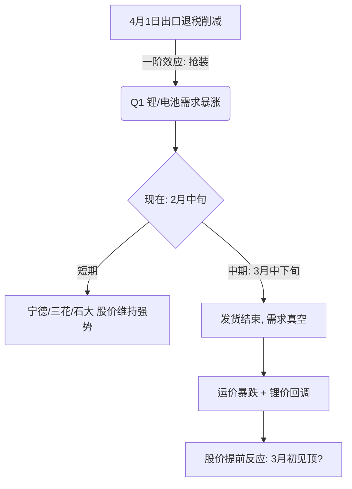

# 📊 期货市场情报简报 | 2026-02-13

> **核心逻辑**：反脆弱 (Antifragility) × 离厄技术分析 × 2026年2月情境
> **今日关键词**：抢装潮末端、通缩博弈、芯片国门大开

---

## 🌡️ 今日市场温度

**"限时狂欢"**。市场当前呈现极其分裂的"双轨制"：
1.  **通缩链（化工/传统制造）**：PPI连续40个月负增长（-1.4%），鲁西化工等传统标的深陷成本坍塌泥潭。
2.  **抢装链（锂电/科技）**：受**4月1日锂电出口退税削减**引发的"末日抢装"，叠加美国1月意外放松AI芯片出口管制，科技与新能源正处于流动性与基本面共振的亢奋期。

---

## 🔴 高优先级信号

### 信号1：锂电出口退税削减倒计时（4月1日生效）
*   **事件**：中国宣布4月1日起削减锂电池出口退税。受此影响，海外车企（特斯拉/欧洲OEM）正在疯狂进行Q1"抢装"，导致1月碳酸锂暴涨46%，2月虽有回调但现货依然紧缺。
*   **评分**：**320分** (增量5 × Price-In4 × 影响4 × 持续4 × 确定性1(政策已定))
*   **深度分析**：
    *   **历史拟合**：类似2020年光伏抢装潮。抢装结束后的次月（4月），需求通常会出现断崖式下跌（-30%以上）。
    *   **多空博弈**：
        *   📈 **多头**：3月前必须完成发货，厂商排产满负荷，现货逼空。
        *   📉 **空头**：这是透支未来的需求，4月后将是一地鸡毛；且目前价格已处于两年来高位。
    *   **天平判断**：**短期多头（至3月中旬）**，中长期极度看空。
*   **传导链**：
    *   一阶：碳酸锂/电解液（**石大胜华**）价格维持高位。
    *   二阶：中游材料厂（**宁德时代/三花智控**）Q1业绩爆表。
    *   三阶：4月后海运运力过剩，运价暴跌。

### 信号2：美国AI芯片出口管制"由堵转疏"
*   **事件**：美国商务部1月13日将高级AI芯片（H200等）出口政策改为"逐案审查"并加征关税，实质上允许了向阿里/腾讯/字节的出口。字节跳动等巨头已下单200万颗芯片。
*   **评分**：**400分** (增量5 × Price-In3 × 影响5 × 持续5 × 确定性0.8)
*   **深度分析**：
    *   **二阶效应**：这是**恒生科技ETF**基本面的根本性反转。之前的逻辑是"缺芯导致算力停滞"，现在的逻辑是"算力基建大跃进"。
    *   **交易信号**：这是结构性做多机会，而非短线反弹。

---

## 🟡 中优先级观察

| 事件 | 评分 | 相关品种 | 观察触发条件 |
|------|------|---------|------------|
| **中国1月PPI -1.4%** | 150 | **鲁西化工** | 若2月数据继续恶化（<-1.5%），确认通缩螺旋，做空化工。 |
| **特朗普"和平委员会"会议 (2月19日)** | 200 | **黄金/原油** | 若会议无实质成果，地缘风险溢价回归，利多原油。 |
| **美联储/中国央行政策背离** | 120 | **恒生/A50** | 中国需进一步降息对抗通缩，关注LPR下调幅度。 |

---

## 📈 持仓与关注品种复盘 (Liè Logic)

### 1. 恒生科技 (513130) —— **重仓/浮亏**
*   **状态**：持仓45%，成本0.692，现价0.682 (-1.45%)。
*   **离厄结构分析**：
    *   **位置（Position）**：0.68-0.69是前期筹码密集区（中枢），目前价格在中枢下沿摩擦。
    *   **动能（Momentum）**：芯片解禁利好尚未完全释放（Price-In程度低），市场仍有疑虑。
    *   **策略**：**持有**。
*   **Liè 信号**：基本面出现了"结构性转换"（美国政策转向），这比K线更重要。只要不有效跌破**0.67**（前低/止损位），维持看多。若有效跌破0.67，说明市场认为"关税+芯片"是对冲抵消，需止损。
*   **操作**：设止损于0.67。不上破0.70不加仓（右侧确认）。

### 2. 三花智控 (002050) / 宁德时代 (300750) —— **浮盈/抢装受益**
*   **状态**：三花浮盈1.39%，宁德强势。
*   **离厄结构分析**：
    *   **位置**：处于"抢装潮"的右侧加速期，价格在高位。
    *   **操纵原理**：警惕"多杀多"。4月1日是明确的利空节点，主力会在那之前完成出货。
*   **Liè 信号**：**移动止损**。
*   **操作**：不要猜顶。将止损上移至**5日均线**（三花约52.5）。只要不破5日线（强趋势特征），就让利润奔跑。一旦收盘跌破5日线，立即止盈50%。
*   **预警**：3月15日前后需高度警惕，那是最后发货窗口关闭的时间。

### 3. 石大胜华 (603026) —— **浮盈/强周期**
*   **状态**：浮盈2.29%。
*   **逻辑**：电解液溶剂直接受益于排产增加。
*   **操作**：同三花。止损设在**65.0**（成本上方，保护本金）。

### 4. 鲁西化工 (000830) —— **浮亏/弱势**
*   **状态**：浮亏2.53%。
*   **逻辑**：PPI通缩受害者。属于"弱势背景"。
*   **离厄反脆弱**：在弱势背景下持有多单是**负期望**操作。
*   **操作**：**止损离场**。若价格反抽至**17.8**（成本区）无法突破，坚决离场。或者跌破**17.2**直接止损。不要在通缩周期里扛化工股。

---

## 📐 逻辑推演：锂电抢装的二阶效应

## 🗓️ 明日重点关注
1.  **石大胜华/三花智控**：是否跌破5日线？（趋势保护）
2.  **恒生科技**：成交量是否放大？（确认芯片利好资金入场）
3.  **地缘消息**：特朗普"和平委员会"的前瞻消息流。

---
*生成时间：2026-02-13 11:45*
