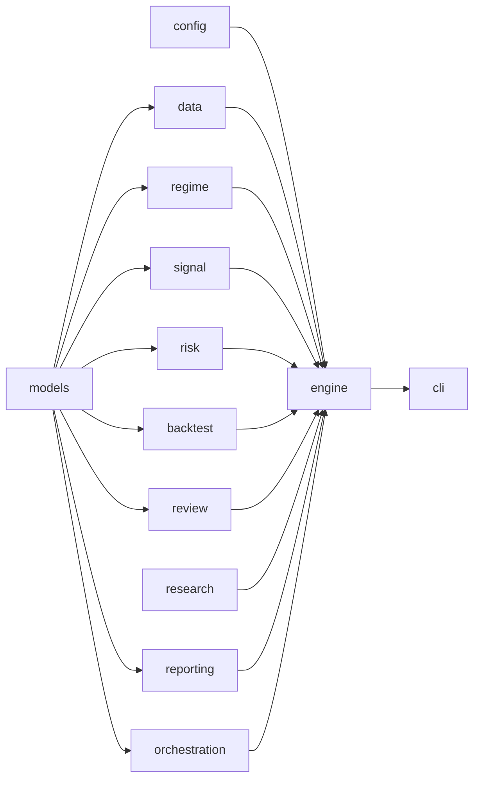

# Demo版版本管理基线（目录+架构全梳理）

> 更新时间：2026-02-17
> 目标：在不改变现有交易系统运行方式的前提下，建立一套可持续、低噪声、可追溯的 demo 级版本管理规范。

## 1. 仓库目录总览（当前实况）

```text
/Users/jokenrobot/Downloads/离厄—技术分析原理
├─ .git/
├─ .gitignore
├─ 深度修正版/                        # 技术分析与策略原理文档
├─ system/                            # 交易系统工程主目录
│  ├─ README.md
│  ├─ pyproject.toml
│  ├─ config.yaml
│  ├─ config.daemon.test.yaml
│  ├─ docs/
│  │  ├─ ARCHITECTURE_REVIEW.md
│  │  ├─ PROGRESS.md
│  │  └─ DEMO_VERSIONING_BASELINE.md
│  ├─ infra/
│  │  ├─ docker-compose.yml
│  │  ├─ cloud/
│  │  └─ local/
│  ├─ scripts/
│  │  └─ auto_git_sync.sh
│  ├─ src/
│  │  └─ lie_engine/
│  │     ├─ cli.py
│  │     ├─ engine.py
│  │     ├─ models.py
│  │     ├─ config/
│  │     ├─ data/
│  │     ├─ regime/
│  │     ├─ signal/
│  │     ├─ risk/
│  │     ├─ backtest/
│  │     ├─ review/
│  │     ├─ reporting/
│  │     ├─ research/
│  │     └─ orchestration/
│  ├─ tests/
│  └─ output/
│     ├─ artifacts/
│     ├─ daily/
│     ├─ logs/
│     ├─ research/
│     └─ review/
└─ *.pdf                              # 研究资料与原理材料
```

## 2. 核心代码层级（职责边界）

- `src/lie_engine/models.py`
  - 统一核心类型：`MarketBar/NewsEvent/RegimeState/SignalCandidate/TradePlan/RiskBudget/BacktestResult/ReviewDelta`。
- `src/lie_engine/config/`
  - 配置加载与校验（系统约束入口）。
- `src/lie_engine/data/`
  - 数据提供器协议、采集融合、质量门禁、存储落盘。
- `src/lie_engine/regime/`
  - 体制识别（Hurst/HMM/ATR_Z 与共识机制）。
- `src/lie_engine/signal/`
  - 趋势/区间引擎，输出 B/S 候选。
- `src/lie_engine/risk/`
  - 仓位、暴露、止损和执行前硬约束。
- `src/lie_engine/backtest/`
  - 事件驱动回测、成本模型、walk-forward。
- `src/lie_engine/review/`
  - 盘后参数更新、变更审计。
- `src/lie_engine/reporting/`
  - 日报、复盘、manifest、压力矩阵输出。
- `src/lie_engine/research/`
  - 多模式研究回测和新策略学习实验室。
- `src/lie_engine/orchestration/`
  - 跨模块编排（调度、放行、审计、依赖检查、可观测性）。
- `src/lie_engine/engine.py`
  - 流程入口与模块装配，尽量保持“薄编排”。
- `src/lie_engine/cli.py`
  - 对外命令入口。

## 3. 依赖方向（经 `dependency-audit` 验证）

当前状态：`ok=true`，无跨层违规。



关键约束：
- `orchestration` 禁止依赖 `engine`（已由测试守卫）。
- `strategy` 相关逻辑不直接触碰 broker（当前首版仅输出建议，不直接实盘下单）。

## 4. 运行路径（按命令分层）

- 交易主链：`run-premarket` -> `run-intraday-check` -> `run-eod` -> `review`
- 审查闭环：`run-review-cycle` / `review-loop`
- 放行与运营：`gate-report` / `ops-report` / `health-check`
- 研究迭代：`research-backtest` / `strategy-lab`
- 压力验证：`stress-matrix`

## 5. 版本管理分级（demo 先用这套）

### A类：必须版本化（代码真相）
- `system/src/**`
- `system/tests/**`
- `system/config*.yaml`
- `system/pyproject.toml`
- `system/docs/**`
- `system/infra/**`
- `system/scripts/**`
- `system/README.md`

### B类：建议版本化（审计与复盘）
- `system/output/review/*.md`
- `system/output/review/*.json`
- `system/output/review/*.yaml`

说明：B类用于“决策可追溯”，但只保留关键报告，不保存大体量中间工件。

### C类：禁止版本化（可再生工件）
- `system/output/artifacts/**`
- `system/output/daily/**`
- `system/output/logs/**`
- `system/output/research/**`
- `__pycache__/`, `*.pyc`, `*.egg-info`, `.DS_Store`

## 6. Demo 分支与提交策略

- 分支约定：
  - `main`：稳定基线。
  - `codex/*`：功能迭代分支（与现有自动脚本一致）。
- 提交粒度：一个模块一个意图，避免“代码+大量输出文件”混提。
- 提交信息模板：
  - `feat(module): ...`
  - `fix(module): ...`
  - `refactor(module): ...`
  - `docs(arch): ...`
  - `test(module): ...`

## 7. Demo 提交流程（最小可执行）

```bash
cd /Users/jokenrobot/Downloads/离厄—技术分析原理/system
python3 -m pip install -e .
lie validate-config
lie test-all --fast --fast-ratio 0.10

cd /Users/jokenrobot/Downloads/离厄—技术分析原理
./system/scripts/auto_git_sync.sh --dry-run
# 确认后
./system/scripts/auto_git_sync.sh --branch codex/demo-versioning --message "docs(arch): establish demo versioning baseline"
```

## 8. 当前风险与改进建议

- 当前 `system/output` 体量大（主要在 `artifacts/`），若误入版本库会快速失控。
- 建议把“可审计”和“可再生”工件彻底分离：
  - 可审计进 `output/review/`
  - 可再生留在 `output/artifacts|daily|logs|research`
- 建议后续新增 `CHANGELOG.md`（按周聚合 A/B 类变更），作为 demo 到正式版的过渡桥。

## 9. 一句话结论

你现在的工程分层已经具备“研究-执行隔离 + 编排守门”的雏形，demo 版本管理只要按本文件的 A/B/C 分级执行，就能在不牺牲迭代速度的情况下，把可追溯性和仓库洁净度同时拉起来。
