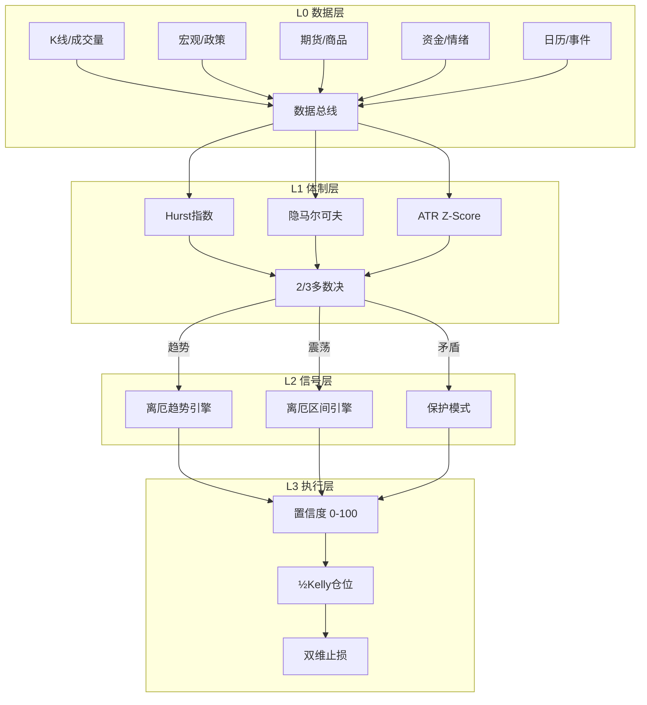

# 离厄 × 反脆弱交易系统 (Liè Antifragile Trading System)

> **公理**：市场是非遍历的——一次爆仓就出局，活着比赚钱重要。
> **目标**：不预测市场，构建一个在混乱中获益的结构。

---

## 系统总览



**四层职责**：

| 层级 | 回答的问题 | 核心模型 |
|------|-----------|---------|
| L0 数据层 | 发生了什么？ | 数据铁律（v3.0） |
| L1 体制层 | 市场处于什么状态？ | Hurst + HMM + ATR |
| L2 信号层 | 在哪里交易？ | 离厄三维共振 |
| L3 执行层 | 下多少注？ | ½Kelly + 哑铃策略 |

---

# L0: 数据层 — 每日自动摄取

## 数据清单

| 类型 | 来源 | 频率 | 关键字段 |
|------|------|------|---------|
| K线 | 东财/同花顺 | 日频 | O/H/L/C/V |
| 宏观 | 统计局/央行 | 事件驱动 | PPI(YoY+MoM), CPI, LPR |
| 期货 | SMM/广期所 | 日频 | LC(碳酸锂), SC(原油), RB(螺纹) |
| 资金 | Choice | 日频 | 北向净流入, 两融, ETF申赎 |
| 情绪 | 期权市场 | 日频 | 50ETF PCR, IV(隐含波动率) |
| 日历 | 交易所 | 事件驱动 | 休市, 交割, 重要会议 |

## 数据铁律（继承Agent规则v3.0）

```
✗ 禁止凭记忆推断指数点位 → 必须搜索最新收盘
✗ 禁止ETF(元)与指数(点)混用
✗ 禁止PPI YoY<0时定义为"绿灯"
✗ 禁止引用已过期政策作为新闻
✓ 价格必须标注来源(SMM/交易所)和合约月份
✓ 政策必须标注完整时间线和当前状态
```

---

# L1: 体制识别层 — 趋势 vs 震荡分离

> **核心哲学**：用错策略比做错方向更致命。
> 趋势行情用均值回归策略 → 被碾压；震荡行情用趋势策略 → 被两面打脸。

## 模型一：Hurst指数（持续性探测器）

### 直觉理解

Hurst指数衡量价格序列的"记忆"——过去的走势对未来有多大影响。

```
H > 0.6 → 趋势体制：涨了还会涨，跌了还会跌
H ≈ 0.5 → 随机游走：过去不预示未来（EMH成立）
H < 0.4 → 均值回归：涨多了会跌回来
```

### 数学推导：R/S（重标极差）分析

设 {r₁, r₂, ..., rₙ} 为 N 天对数收益率序列。

**Step 1 — 分段**：将序列分为 k 段，每段长度 n

**Step 2 — 去均值**：每段计算均值 μ，得偏差序列
$$Y_t = r_t - \mu$$

**Step 3 — 累积偏差**：
$$Z_t = \sum_{i=1}^{t} Y_i$$

**Step 4 — 极差**：
$$R(n) = \max(Z_1,...,Z_n) - \min(Z_1,...,Z_n)$$

**Step 5 — 标准差**：
$$S(n) = \sqrt{\frac{1}{n}\sum_{i=1}^{n}(r_i - \mu)^2}$$

**Step 6 — 重标极差**：
$$\frac{R(n)}{S(n)} \propto n^H$$

**Step 7 — 拟合**：
$$\log\left(\frac{R}{S}\right) = H \cdot \log(n) + c$$

斜率 H 即为 Hurst 指数。

### 参数与A股校准

| 参数 | 建议值 | 理由 |
|------|-------|------|
| 滚动窗口 | 60-120交易日 | A股约3-6个月，覆盖一个完整震荡周期 |
| 子序列长度 | 10, 20, 30, 40, 60 | 多尺度计算取平均 |
| 趋势阈值 | H > 0.6 | 文献标准0.5，A股噪音大需提高 |
| 均值回归阈值 | H < 0.4 | 对称设定 |
| 更新频率 | 每日收盘后 | 滚动计算 |

### 实战解读示例

```
某日计算结果：H = 0.72

解读：强趋势体制。价格存在显著正自相关，
      动量策略有效，均值回归策略危险。
策略：跟随趋势，不做逆势抄底。
```

---

## 模型二：隐马尔可夫模型（HMM，体制分类器）

### 直觉理解

市场在"牛市"、"震荡"、"熊市"之间切换，但你看不到当前处于哪个状态——只能通过收益率和波动率去**推断**。HMM就是做这个推断的概率机器。

```
┌─────────┐    ┌─────────┐    ┌─────────┐
│  🟢 牛市  │◄──►│  🟡 震荡  │◄──►│  🔴 熊市  │
│ μ>0, σ小 │    │ μ≈0, σ中 │    │ μ<0, σ大 │
└─────────┘    └─────────┘    └─────────┘
    每个状态会"发射"不同分布的收益率
```

### 三个隐藏状态的特征

| 状态 | 日均收益率(μ) | 日均波动率(σ) | 持续天数(中位数) |
|------|-------------|-------------|----------------|
| 🟢 牛市 | +0.1% ~ +0.3% | 0.8% ~ 1.2% | 30-60天 |
| 🟡 震荡 | -0.05% ~ +0.05% | 1.0% ~ 1.5% | 20-40天 |
| 🔴 熊市 | -0.2% ~ -0.5% | 1.5% ~ 3.0% | 10-30天 |

### 输入特征（可观测变量）

```
X = [r₅, σ₂₀, ΔV₂₀]

r₅  = 5日对数收益率（方向信号）
σ₂₀ = 20日历史波动率（波动信号）
ΔV₂₀ = 20日成交量变化率（参与度信号）
```

### 输出

```
P(State | X) = [P(牛), P(震荡), P(熊)]

示例：[0.15, 0.70, 0.15]
→ 70%概率处于震荡体制 → 使用区间引擎
```

### 关键约束

- **滞后性**：HMM通常延迟2-5天识别体制切换，不可用于短线择时
- **过拟合风险**：状态数固定为3（用BIC准则验证），禁止超过4
- **用途限定**：仅用于**策略选择**，不用于入场信号

---

## 模型三：ATR Z-Score（波动率体制）

### 直觉理解

用当前波动率在历史中的相对位置，判断市场是"平静"还是"疯狂"。

### 计算

```
ATR₁₄ = 14日平均真实波幅
ATR_μ₆₀ = 60日ATR均值
ATR_σ₆₀ = 60日ATR标准差

ATR_Z = (ATR₁₄ - ATR_μ₆₀) ÷ ATR_σ₆₀
```

### 解读

| ATR_Z | 波动率体制 | 市场含义 | 策略调整 |
|-------|-----------|---------|---------|
| > 2.0 | 🔴 极端 | 黑天鹅/恐慌 | 减仓至½，止损ATR加宽至2× |
| > 1.0 | 🟠 高波动 | 趋势加速 | 跟随但紧止损 |
| [-1, 1] | 🟢 正常 | 标准环境 | 标准策略 |
| < -1.0 | 🔵 极低 | 暴风雨前的宁静 | 准备突破交易，挂突破单 |

---

## 体制共识：2/3多数决

> **铁律**：当模型之间矛盾时，**降低仓位而非强行判断**。不确定性本身就是信息。

| Hurst | HMM最大概率 | ATR_Z | 最终体制 | 启动引擎 |
|-------|-----------|-------|---------|---------|
| >0.6 | 🟢牛 >0.6 | >0 | ✅ **强趋势** | 趋势引擎，宽止损 |
| >0.6 | 🟢牛 >0.6 | <0 | ✅ **弱趋势** | 趋势引擎，标准止损 |
| <0.4 | 🟡震荡 >0.6 | ∈[-1,1] | ✅ **震荡** | 区间引擎，紧止损 |
| >0.6 | 🔴熊 >0.6 | >1 | ✅ **下跌趋势** | 空头/对冲，远离做多 |
| 矛盾 | 概率<0.6 | 任意 | ⚠️ **不确定** | 保护模式，½仓位 |
| 任意 | 任意 | >2.0 | 🚨 **极端波动** | 保护模式，紧急减仓 |

### 体制输出示例

```
═══════════════════════════════════════
 体制诊断 | 2026-02-13

 Hurst(120日) = 0.58  → 弱趋势/中性
 HMM概率 = [0.30, 0.55, 0.15] → 震荡倾向
 ATR_Z = -0.3  → 正常波动

 共识：2/3 → 震荡（Hurst中性+HMM震荡）
 启动引擎：区间引擎
 仓位修正：标准（100%信号仓位）
═══════════════════════════════════════
```

---

# L2: 信号层 — 离厄技术分析引擎

> 体制决定"该做什么"，信号决定"在哪里做"。

## 趋势引擎（体制=趋势时启动）

基于离厄修正版核心：**位置 × 结构 × 动能** 三维共振。

### 三维评分表

#### 位置分 Position（满分5分）

| 条件 | 分数 | 来源 |
|------|------|------|
| 价格在20日线之上且20日线斜率向上 | +2 | 均线交易系统修正版 |
| 价格在60日线之上 | +1 | 大级别趋势保护 |
| 价格触及FVG/OB回撤区域（0.618-0.786） | +2 | ICT原理修正版 |

#### 结构分 Structure（满分7分）

| 条件 | 分数 | 来源 |
|------|------|------|
| 出现MSS/CHOCH（市场结构转换） | +3 | ICT交易系统修正版 |
| 高低点序列保持趋势一致（HH-HL或LL-LH） | +2 | 价格行为原理修正版 |
| 中枢突破后回踩不破（二买/三买） | +2 | 缠论修正版 |

#### 动能分 Momentum（满分5分）

| 条件 | 分数 | 来源 |
|------|------|------|
| 出现吞没/Pin Bar（关键位置） | +2 | 价格行为原理修正版 |
| FVG未填补（公允价值缺口存在） | +1 | ICT原理修正版 |
| 突破时成交量放大（≥1.5倍20日均量） | +2 | 订单流修正版 |

### 置信度计算

```
原始分 = Position + Structure + Momentum (满分17)
置信度 = 原始分 ÷ 17 × 100%

置信度分级：
  🟢 >70% → 高置信，标准仓位入场
  🟡 50-70% → 中置信，½仓位入场
  🔴 <50% → 低置信，不交易
```

### 趋势引擎示例

```
═══════════════════════════════════════
 趋势引擎 | 宁德时代 300750 | 2026-02-13

 Position:
   ✓ 20日线之上, 斜率向上 (+2)
   ✓ 60日线之上 (+1)
   ✗ 未触及FVG/OB区域 (+0)
   小计: 3/5

 Structure:
   ✓ 近期出现CHOCH (突破前高) (+3)
   ✓ HH-HL序列保持 (+2)
   ✗ 无中枢回踩信号 (+0)
   小计: 5/7

 Momentum:
   ✓ 昨日大阳线吞没 (+2)
   ✓ 存在未填补FVG (+1)
   ✗ 成交量放大但未达1.5倍 (+0)
   小计: 3/5

 总分: 11/17 = 64.7%
 置信度: 🟡 中，建议½仓位
═══════════════════════════════════════
```

---

## 区间引擎（体制=震荡时启动）

基于离厄修正版核心：**流动性扫荡 × 均值回归 × 成交量确认**。

### 三维评分表

#### 流动性扫荡分 Liquidity Sweep（满分5分）

| 条件 | 分数 | 来源 |
|------|------|------|
| 价格刺穿前高/前低后迅速收回（假突破） | +3 | 市场操纵原理修正版 |
| 假突破伴随长上/下影线 | +2 | 技术形态修正版 |

#### 均值回归分 Mean Reversion（满分5分）

| 条件 | 分数 | 来源 |
|------|------|------|
| 价格偏离20日线超过2个ATR | +2 | 均线交易系统修正版 |
| RSI进入超买/超卖区（>70 / <30） | +1 | 情绪周期修正版 |
| 价格临近中枢上/下沿 | +2 | 缠论修正版 |

#### 成交量确认分 Volume Confirm（满分4分）

| 条件 | 分数 | 来源 |
|------|------|------|
| 扫荡时缩量（假突破特征） | +2 | 订单流修正版 |
| 反转时放量（真反转特征） | +2 | 订单流修正版 |

### 置信度计算

```
原始分 = LS + MR + VC (满分14)
置信度 = 原始分 ÷ 14 × 100%

分级：同趋势引擎
```

---

## 保护模式（体制=不确定 或 ATR_Z>2）

```
规则：
  1. 不开新仓
  2. 现有仓位止损收紧至 1×ATR
  3. 仅允许操作：
     - 买入虚值看跌期权（对冲尾部风险）
     - 减仓至总仓位 < 30%
  4. 每日扫描黑天鹅清单
```

---

# L3: 执行层 — 反脆弱仓位管理

## ½ Kelly仓位公式

### 直觉

Kelly准则告诉你：**在胜率和赔率确定时，该把多少钱押上去才能最大化长期增长率**。但Full Kelly波动太大，我们取一半——牺牲少量收益，换取大幅降低爆仓风险。

### 公式

```
f* = (p × b - q) ÷ b

其中：
  p = 策略历史胜率（滚动最近60笔交易）
  q = 1 - p = 败率
  b = 平均盈亏比 = 平均盈利 ÷ 平均亏损

实际仓位 = ½ × f* × 置信度修正
```

### 实例

```
假设：
  胜率 p = 0.45 (45%)
  盈亏比 b = 2.5 (平均赚2.5倍止损)

Kelly% = (0.45 × 2.5 - 0.55) ÷ 2.5
       = (1.125 - 0.55) ÷ 2.5
       = 0.575 ÷ 2.5
       = 23%

½Kelly = 11.5%

若置信度 = 65%（中）：
  实际仓位 = 11.5% × 0.65 = 7.5%

→ 即在一个信号上投入账户总资金的 7.5%
```

### 硬性约束

```
max(单笔风险) ≤ 2% × 账户净值
max(总暴露) ≤ 50% × 账户净值 (哑铃策略)
max(单品种) ≤ 15% × 账户净值
max(同板块) ≤ 25% × 账户净值 (锂电=宁德+三花+石大)
```

---

## 双维止损体系

### 价格止损

```
趋势体制：
  止损 = 入场价 - 1.5 × ATR₁₄
  → 宽止损，给趋势空间呼吸

震荡体制：
  止损 = 入场价 - 1.0 × ATR₁₄
  → 窄止损，快速认错
```

### 时间止损（离厄独创）

```
如果入场后 N 天内浮盈未达 0.5×ATR → 平仓出场

N 的取值：
  短线信号：N = 3-5 天
  波段信号：N = 8-10 天

理由：
  好的入场点通常很快产生浮盈。
  如果迟迟不动，说明你的判断在这个特定时点是错误的。
  时间 = 机会成本，占用资金比亏损更危险。
```

### 移动止损（趋势体制专用）

```
浮盈触发         止损移动至
─────────────    ──────────────
> 1×ATR          入场价 (保本)
> 2×ATR          入场价 + 1×ATR
> 3×ATR          浮盈的 50%
> 5×ATR          浮盈的 60% + 5日线跟踪
```

---

## Taleb哑铃策略：资金配置

```
总账户
├── 80-90%：安全仓（Antifragile Base）
│   ├── 现金/货基：即时流动性
│   ├── 国债ETF：低波动+利息
│   └── 目的：活下来，保本金
│
└── 10-20%：凸性仓（Convexity Bucket）
    ├── 主力：趋势/区间信号仓位（½Kelly计算）
    ├── 卫星：远期虚值期权（<3%资金）
    │   └── 收益：有限亏损(权利金) vs 无限收益
    └── 目的：捕捉黑天鹅的正面效应
```

### 凸性检测（每笔交易自检）

```
凸性比 = 最大可能盈利 ÷ 最大可能亏损

凸性比 > 3  → ✅ 凸性交易（反脆弱）
凸性比 1-3  → ⚠️ 线性交易（审慎）
凸性比 < 1  → ❌ 凹性交易（禁止）

每笔交易入场前必须计算此比值。
凹性交易 = 做空波动率 = 你在笃定世界不会崩塌。
```

---

# 每日工作流（Agent自动执行）

```
T+0 收盘后 (15:00-16:00)
├── 1. 数据摄取：K线/资金/情绪/期货 → 数据总线
├── 2. 体制计算：Hurst + HMM + ATR_Z → 体制共识
├── 3. 信号扫描：启动对应引擎 → 扫描关注池
├── 4. 仓位计算：½Kelly × 置信度 → 建议仓位
├── 5. 凸性自检：每个信号的凸性比 > 3？
└── 6. 输出简报：体制 + 信号 + 仓位 + 止损

T+1 盘前 (08:30-09:15)
├── 7. 日历核查：交易日？事件？
├── 8. 隔夜核查：外盘/汇率/政策
└── 9. 信号修正：如有变化 → 调整置信度

T+1 盘中 (实时)
├── 10. 执行监控：触发入场/止损？
└── 11. 黑天鹅监控：突发事件？

T+1 收盘后
└── 12. 复盘：实际 vs 预测，更新胜率/盈亏比
```

---

# 简报输出模板

```
══════════════════════════════════════════════════
📊 离厄反脆弱简报 | YYYY-MM-DD (周X)
══════════════════════════════════════════════════

🌡️ 市场温度计
[一句话核心矛盾] | [节前第X天/距休市X天]

──────────────────────────────────────────────────
🔬 体制诊断
Hurst(120日) = X.XX → [趋势/中性/均值回归]
HMM = [P(牛)=XX%, P(震荡)=XX%, P(熊)=XX%]
ATR_Z = X.XX → [极低/正常/高/极端]
共识：[趋势/震荡/不确定] → 启动[XX引擎/保护模式]

──────────────────────────────────────────────────
🎯 信号扫描

[标的名] [代码]
  体制：[趋势/震荡]
  位置：X/5 | 结构：X/7 | 动能：X/5
  置信度：XX% [🟢高/🟡中/🔴低]
  凸性比：X.X [✅/⚠️/❌]
  建议：[方向] [仓位%] [入场价] [止损价] [目标价]

──────────────────────────────────────────────────
📈 持仓状态

| 标的 | 成本 | 现价 | 浮盈 | 止损 | 状态 |
|------|------|------|------|------|------|
|      |      |      |      |      |      |

──────────────────────────────────────────────────
📉 黑天鹅扫描
- [低概率高冲击事件1]
- [低概率高冲击事件2]

──────────────────────────────────────────────────
🗓️ 明日路演
- [事件1]：[影响]
- [关键点位]：[上方压力] / [下方支撑]

══════════════════════════════════════════════════
```

---

# 风险声明与系统局限性

## 模型局限

| 模型 | 已知缺陷 | 应对措施 |
|------|---------|---------|
| Hurst | 窗口长度影响结果，短窗口噪音大 | 多尺度平均 |
| HMM | 滞后2-5天，体制切换时信号延迟 | 仅用于策略选择，不用于择时 |
| Kelly | 依赖历史胜率，未来可能变化 | 取½Kelly，加硬性上限 |
| 三维共振 | 主观评分，不同人打分不同 | 明确评分标准，禁止模糊加分 |

## 系统不能做什么

1. **不能预测黑天鹅**：只能识别脆弱性（做空波动率的仓位）
2. **不能消除亏损**：只能让亏损可控，让盈利奔跑
3. **不能替代纪律**：系统给出建议，执行靠人
4. **不能保证胜率**：目标是正期望值，不是每笔都赚

## 反脆弱自检清单

每周日执行：

```
□ 我的总仓位是否 < 50%？（哑铃安全区）
□ 每笔止损是否 < 2% 账户净值？
□ 我是否有黑天鹅对冲仓位？（虚值期权/反向ETF）
□ 我是否在做空波动率？（卖期权/加杠杆/笃定某事）
□ 如果明天市场跌10%，我能否承受？
□ 我的凸性比是否 > 3？
□ 我是否在复盘上周的预测准确率？
```

> **终极测试**：如果你无法清晰描述"这笔交易的最大亏损是多少"，你就不应该进场。

---

*版本：v1.0 | 离厄深度修正版 × 塔勒布反脆弱 × Hurst/HMM/Kelly*
*设计原则：深入浅出，数据不重复纠缠，每一层只做一件事*
